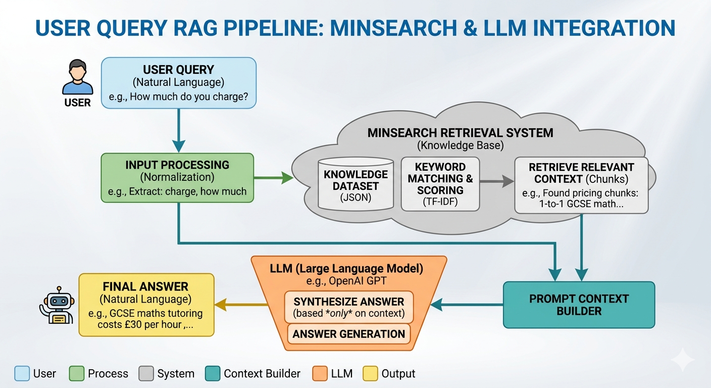
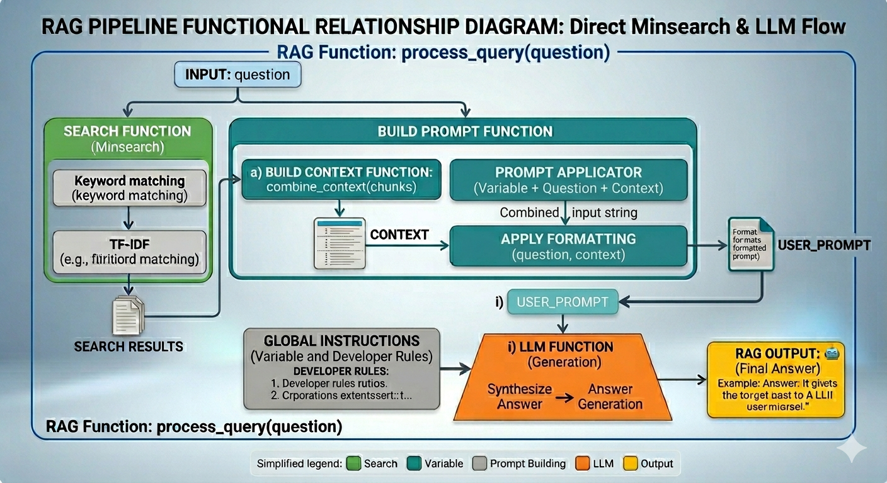
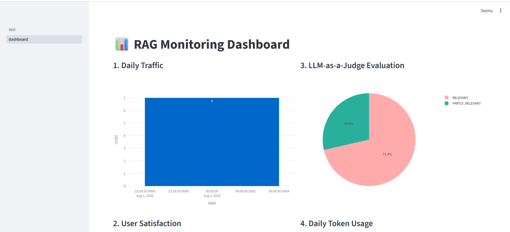
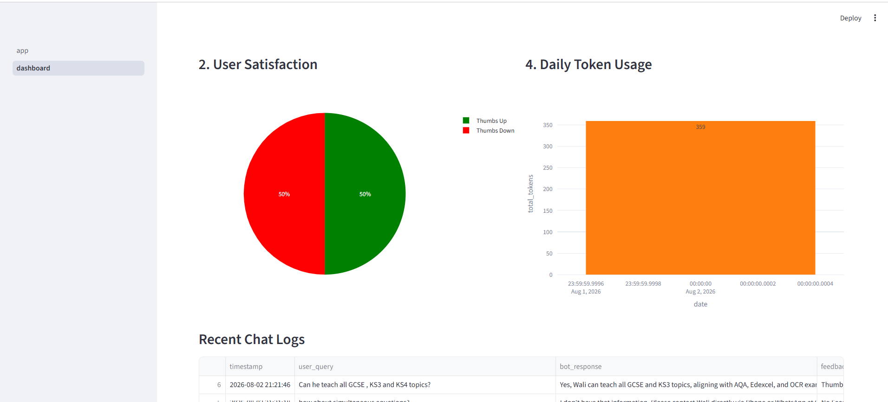
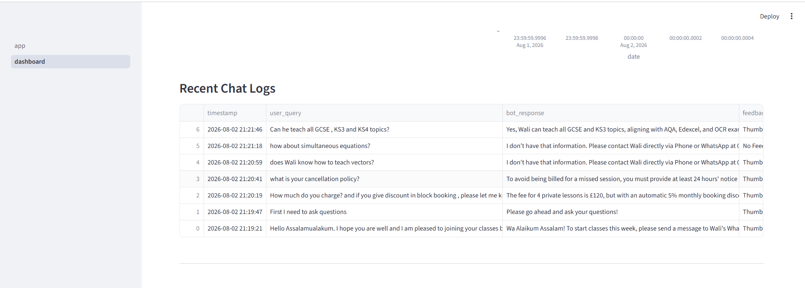
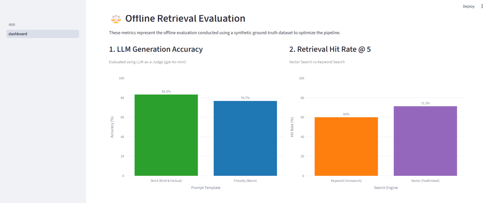

# agentic-tutor-rag
An Agentic RAG virtual assistant for GCSE math tutoring, featuring tool calling, evaluation, and monitoring. Built for LLM Zoomcamp 2026.


## 🎯 1. Problem Description
Navigating independent tutoring services can be confusing for parents and students. They frequently ask the same questions: *"Do you cover Higher Tier AQA?"*, *"How much is a 1-hour session?"*, or *"Do you provide homework?"* 
Wali solves this by acting as a 24/7 automated assistant, answering logistical and academic FAQ questions instantly by retrieving facts from a structured knowledge base, saving the tutor hours of administrative work.
## 🧠 2. RAG Flow

The application uses a custom Retrieval-Augmented Generation (RAG) architecture designed to retrieve relevant mathematical tutoring content before generating an answer.

The overall pipeline consists of three main stages:

1. **Retrieval:** Relevant content is retrieved from the knowledge base using semantic vector search.
2. **Context Construction:** Retrieved chunks are assembled into a structured prompt.
3. **Generation:** `gpt-4o-mini` generates the final response using the retrieved context and predefined instructions.

### High-Level RAG Architecture



*Figure 1: High-level RAG pipeline showing the flow from user query through retrieval, context construction, and LLM generation.*

### Knowledge Base

The knowledge base consists of structured JSON FAQ and tutoring data containing the information available to the RAG system.

### Retrieval Engine

The application uses semantic vector search with `FastEmbed` and the `BAAI/bge-small-en-v1.5` embedding model. This allows the system to retrieve content based on semantic meaning rather than relying solely on exact keyword matches.

This helps address vocabulary differences between a user's query and the wording used in the knowledge base.

### LLM Generation

The retrieved context is passed to `gpt-4o-mini` through a controlled prompt template. The model is instructed to generate answers using the retrieved context rather than relying on unsupported information.

---

## 🏗️ Architecture & Retrieval Strategy

This project implements a custom, lightweight RAG pipeline without relying on heavy orchestration frameworks such as LangChain. The main components are implemented directly to provide greater control over retrieval, prompting, evaluation, and observability.

### Retrieval and Generation Pipeline

At the implementation level, a user query passes through the following flow:

```text
User Query
    ↓
Query Processing
    ↓
Vector Search
    ↓
Relevant Chunks
    ↓
Context Construction
    ↓
Prompt Construction
    ↓
OpenAI LLM
    ↓
Final Answer
```

The functional relationship between these components is shown below.



*Figure 2: Functional relationship between the retrieval, prompt-building, and generation components.*

### The Engine

- **Embeddings:** ONNX-based embedding models provide lightweight and efficient vectorization.
- **Vector Search:** A custom `VectorIndex` uses NumPy matrix operations for similarity search, providing direct control over the retrieval process.
- **Generation:** The OpenAI API (`gpt-4o-mini`) generates responses using the retrieved context and controlled prompt instructions.
- **Telemetry:** A SQLite database records user queries, generated responses, and user feedback such as thumbs up/down.

### Why a Custom RAG Pipeline?

Rather than hiding the retrieval process behind a framework, the project implements the core RAG components directly. This makes it possible to:

- control the embedding and retrieval process;
- inspect and evaluate retrieval independently from generation;
- experiment with different retrieval strategies;
- add query planning and agentic behaviour;
- instrument the pipeline for monitoring and evaluation;
- understand exactly how retrieved context reaches the LLM.
---
## 📊 3. Evaluation Framework

To compare different retrieval approaches, I built an evaluation pipeline using a manually curated ground-truth dataset. Each system was evaluated using two standard information retrieval metrics:

- **Hit Rate** – Percentage of queries where the correct document appears in the retrieved results.
- **Mean Reciprocal Rank (MRR)** – Measures how highly the correct document is ranked, rewarding systems that return the correct answer earlier.

### Retrieval Systems Evaluated

#### Vector-Based Retrieval
These systems all use semantic vector search as their primary retrieval method.

1. **Baseline (Vector Search Only)**
   - Direct semantic vector search using the ONNX embedding index.
   - No query rewriting, reranking, or agentic reasoning.

2. **Advanced RAG**
   - LLM query rewriting.
   - Semantic vector retrieval.
   - Cross-Encoder reranking.

3. **Agentic RAG**
   - OpenAI JSON-mode query planner.
   - Dynamically analyses the user query before retrieval.
   - Semantic vector retrieval.
   - Cross-Encoder reranking.

#### Keyword-Based Retrieval

4. **Keyword Search (Minsearch)**
   - Traditional lexical search using Minsearch.
   - No semantic embeddings.

---

## 📈 Evaluation Results

| Rank | Retrieval System | Retrieval Type | Hit Rate | MRR |
|------|------------------|----------------|---------:|----:|
| 🥇 | **Baseline (Vector Search)** | Semantic Vector | **77.59%** | **0.5188** |
| 🥈 | **Agentic RAG** | Semantic Vector | **68.97%** | **0.3536** |
| 🥉 | **Keyword Search (Minsearch)** | Keyword | **62.07%** | **0.3996** |
| 4 | **Advanced RAG** | Semantic Vector | **38.79%** | **0.2464** |

### Key Findings

- The **Baseline Vector Search** achieved the highest overall performance, with the best **Hit Rate (77.59%)** and **MRR (0.5188)**.
- **Keyword Search (Minsearch)** outperformed the Advanced RAG pipeline on both evaluation metrics, demonstrating that lexical retrieval remains effective for exact-term queries.
- The **Agentic RAG** pipeline substantially improved upon the original Advanced RAG, although it did not surpass the simple vector-only baseline.
- These results highlight that adding more sophisticated retrieval logic does not automatically improve performance, reinforcing the importance of rigorous evaluation when designing RAG systems.
### The Engineering Decision

Despite building a fully functional Agentic Hybrid RAG pipeline, the data proved that the **Baseline Vector Search** outperformed the more complex architectures for this specific math-tutoring dataset. 

Following the engineering principle of deploying the simplest, fastest, and most cost-effective model that meets requirements, the final Streamlit application is powered purely by the optimized `VectorRAG` pipeline. This avoids LLM semantic drift, eliminates extra API costs for query planning, and significantly reduces user latency.

## ⚖️ 4. LLM Generation Evaluation
The LLM generation phase was evaluated using the **LLM-as-a-Judge** standard (powered by `gpt-4o-mini` and Pydantic structured outputs) to measure semantic equivalence to the ground truth.
* **Strict Prompt (Brief & Factual):** **83.3%** Accuracy
* **Friendly Prompt (Warm & Polite):** 76.7% Accuracy
* **Conclusion:** The Strict prompt was chosen for the final application to maximize factual reliability. (See notebook: `evaluation.ipynb`).

## 🖥️ 5. Interface
The interface is built with **Streamlit**, featuring:
* A conversational chat UI using `st.chat_message`.
* Session state memory to preserve chat history.
* A multi-page layout containing the main bot and a dedicated analytics dashboard.

## 🚰 6. Ingestion Pipeline
Data ingestion is fully automated using **dlt (Data Load Tool)**.
Instead of reading raw JSON files directly in the app, the `ingest_pipeline.py` script automatically extracts the data, infers the schema, and loads it into a local **DuckDB** data warehouse. The Streamlit app then queries this DuckDB database to build its vector index.

## 📈 7. Monitoring
The application monitors usage and collects user feedback:
* **Feedback:** A thumbs-up/thumbs-down widget captures user satisfaction.
* **Storage:** Chats and feedback are logged locally using **SQLite** (`data/chat_logs.db`).
* **Dashboard:** A Streamlit dashboard (`pages/dashboard.py`) utilizes `Plotly` to display 5 distinct charts: Daily Traffic, User Satisfaction (Pie), Peak Usage Hours, Query Length Distribution, and Feedback Trends over time.

## 🖼️ Dashboard Gallery

Here is a preview of the monitoring and analysis dashboard:

<p align="center">
  
  
</p>
<p align="center">
  
  
</p>

## 🐳 8. Reproducibility & Containerization
The project is fully reproducible and containerized.
* Dependency management is strictly handled by **`uv`**.
* A `Dockerfile` and `docker-compose.yaml` are provided.
* Because the architecture utilizes local file-based databases (DuckDB & SQLite), no heavy external database containers are required. Docker Compose seamlessly mounts the `./data` volume so all databases and logs persist across container restarts.

---
## Repository Structure

```text
agentic-tutor-rag/
├── data/
│   ├── chat_logs.db
│   ├── ground_truth.json
│   ├── knowledge-base.json
│   └── tutor_pipeline.duckdb
├── modules/
│   ├── db.py
│   ├── ground_truth.py
│   ├── ingest_pipeline.py
│   ├── ingest.py
│   └── rag_helper.py
├── pages/
│   ├── dashboard.py
│   ├── img1.png
│   ├── img2.png
│   ├── img3.png
│   ├── img4.png
│   ├── RAG.png
│   └── RAGfunctions.png
├── .env
├── .gitignore
├── .python-version
├── 1-retrieval-flow.ipynb
├── 2-retrieval-evaluation.ipynb
├── 3-LLM-Evaluation.ipynb
├── app.py
├── chat_logs.db
├── docker-compose.yaml
├── Dockerfile
├── LICENSE
├── main.py
├── Makefile
├── pyproject.toml
├── README.md
├── resetdb.py
└── uv.lock
```

# 🚀 Quick Start / Reproducibility

## 1. Clone the Repository

```bash
git clone https://github.com/Wali-Mohamed/agentic-tutor-rag.git
cd agentic-tutor-rag
```

> **Alternative:** You can also open the repository directly in **GitHub Codespaces** by clicking **Code → Codespaces → Create codespace on main**.

---

## 2. Prerequisites

Before running the project, install the following tools:

### Docker Desktop *(Required for the Docker option)*

https://docs.docker.com/get-docker/

### uv *(Required for local setup and ingestion)*

https://docs.astral.sh/uv/getting-started/installation/

### Make *(Optional but recommended)*

A `Makefile` is included to simplify common commands.

**macOS**
```bash
xcode-select --install
```

or

```bash
brew install make
```

**Linux**
```bash
sudo apt install make
```

**Windows**

Install via Scoop:

```powershell
scoop install make
```

or use **WSL** or **Git Bash**.

> **Note:** If you don't have `make`, equivalent commands are provided throughout this guide.

---

## 3. Configure Environment Variables

Create a `.env` file in the project root and add your OpenAI API key:

```env
OPENAI_API_KEY=sk-your-api-key-here
```

---

# Option A: Run with Docker (Recommended)

### Step 1: Build the Knowledge Base

Before launching the application, build the local DuckDB knowledge base:

```bash
make ingest
```

**Without Make:**

```bash
uv run python modules/ingest_pipeline.py
```

This creates:

```
data/tutor_pipeline.duckdb
```

---

### Step 2: Build and Start the Application

```bash
make up
```

**Without Make:**

```bash
docker compose up --build -d
```

Open the application:

```
http://localhost:8501
```

---

### Stop the Docker Containers

```bash
make down
```

**Without Make:**

```bash
docker compose down
```

---

# Option B: Run Locally

### Step 1: Install Dependencies

```bash
make setup
```

**Without Make:**

```bash
uv sync
```

---

### Step 2: Build the Knowledge Base

```bash
make ingest
```

**Without Make:**

```bash
uv run python modules/ingest_pipeline.py
```

This creates:

```
data/tutor_pipeline.duckdb
```

---

### Step 3: Launch the Streamlit Application

```bash
make run
```

**Without Make:**

```bash
uv run streamlit run app.py
```

Open the application:

```
http://localhost:8501
```

---
### 📊 Step 4: Simulate Dashboard Data (For Reviewers)
Since the database is excluded from version control, your dashboard will initially be empty. To quickly populate the SQLite database and see the Streamlit monitoring charts in action, open a new terminal window while the app is running and execute the synthetic data generator:

```bash
uv run python generate_data.py
```
> **Note:** This script pushes realistic Q&A pairs into the database continuously. Leave it running in the background while you explore the `pages/dashboard.py` interface to watch the charts update dynamically! Press `Ctrl+C` in the terminal to stop it.


### Stop the Streamlit Application

Press **Ctrl + C** in the terminal running Streamlit.